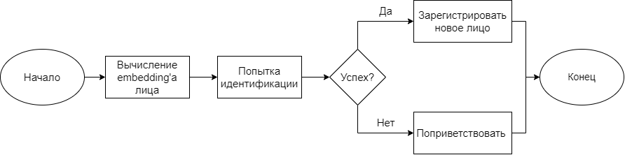

# Распознавание лиц
Проект разработан в рамках курса "Глубокое обучение на Pytorch" в университете РТУ МИРЭА

## Использование
Для локального запуска веб интерфейса нужно ввести команду
```commandline
streamlit run .\src\ui_inference.py
```

В окне браузера откроется страница, на которой будет предложено сделать 
фотографию через веб-камеру. Возможности интерфейса включают в себя поиск
знакомых лиц и регистрацию новых.

## Принцип работы
Распознавание лиц:
1. Предобученная нейронная сеть вычисляет embedding лица.
2. В JSON-файле находится наиболее похожее лицо по косинусному расстоянию.
3. Полученное ФИО озвучивается с помощью text2speech модели.

Регистрация пользователей:
1. Предобученная нейронная сеть вычисляет embedding лица.
2. Embedding записывается в JSON-файл и соответствует ФИО пользователя.



## Пример работы

[streamlit-ui_inference.webm](https://github.com/mirea-face-recognition/face-recognition/assets/41271647/c7481f1c-0cd9-4bef-a58f-197442d63f61)

## Дальнейшие планы
1. Реализовать работу системы в режиме реального времени
2. Развернуть систему в институте ИТ 

## Использованные технологии
- PyTorch
- deepface
- streamlit
